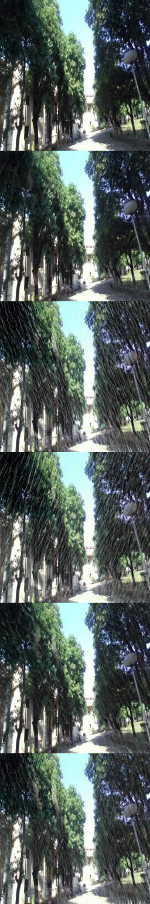
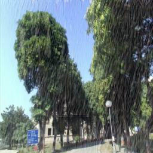

# SyRA GAN: Synthetic Rain Generation using GAN
## By Aaditya Gupta-IIT2021242 and Nitesh Kumar Shah-IIB2021002
### Project Overview

**SyRA GAN** (Synthetic Rain Generation using GAN) is a cutting-edge project aimed at enhancing flight simulators by incorporating synthetic rain effects. By leveraging the power of Generative Adversarial Networks (GANs), SyRA GAN simulates decreased visibility in the environment, providing a more realistic and challenging training experience for pilots.

## Why SyRA GAN?

In flight simulation training, replicating adverse weather conditions such as rain is crucial for preparing pilots for real-world scenarios. SyRA GAN achieves this by generating high-quality synthetic rain effects that decrease visibility, making the simulation environment more immersive and realistic.

### Custom Dataset

To train and evaluate SyRA GAN, we utilized two datasets:

1. **Flight Simulator Dataset** (Kaggle): A dataset consisting of approximately 12,000 clean images used as the base for generating synthetic rain effects.

2. **IIIT Dataset**: A custom dataset created at IIIT Allahabad, comprising 1,500 paired and sequence images from the CC1 to CC3 building dataset. This dataset includes clean and adverse weather conditions, serving as the foundation for our synthetic rain generation.
### Sequence involved in  Image Generation


### Rain Effected Image

### Objective

The primary objective of SyRA GAN is to generate realistic synthetic rain effects to decrease visibility in flight simulators. Additionally, within the IIIT Dataset, the goal was to create rain effects to decrease visibility in the ADAS (Advanced Driver Assistance Systems) framework, thereby providing a more realistic training environment for both pilots and autonomous driving systems.

## Why Use GANs?

GANs are ideally suited for generating realistic synthetic data. The architecture of a GAN consists of two components: the **Generator** and the **Discriminator**. These two networks work in tandem to produce high-quality, realistic rain effects essential for simulating adverse weather conditions in flight simulators.

### Advantages of Using GANs

- **Realism**: GANs are capable of generating visually convincing synthetic rain effects that closely mimic real-world conditions.
- **Efficiency**: Unlike traditional methods, GANs do not rely on Markov chains, reducing computation and training time.
- **Versatility**: GANs can be used for a range of tasks such as object detection, semantic segmentation, and localization, making them highly adaptable for different simulation needs.

## GAN Architecture

*Details of the GAN architecture will be provided here, including the structure of the generator and discriminator networks, the loss functions used, and any other relevant architectural decisions.*

## Dataset Overview

1. **Flight Simulator Dataset**: Sourced from Kaggle, containing 12,000 clean images that serve as the base for rain effect generation.
   
2. **IIIT Dataset**: A custom dataset containing 1,500 paired and sequence images of road conditions under clean and adverse weather, collected from the CC1 to CC3 buildings at IIIT Allahabad.

## Key Tasks

The main tasks tackled by SyRA GAN include:

- **Object Detection**: Identifying objects within the rain-affected images.
- **Semantic Segmentation**: Classifying each pixel of an image into different categories.
- **Localization**: Determining the location of objects within the images.

## Installation

To run the SyRA GAN project locally, please follow these steps:

1. Clone the repository:
   ```bash
   git clone https://github.com/addygupta21/SyRA.git

## References
[1] Yang, Wenhan, et al. "Deep joint rain detection and removal from a single image." Proceedings of the IEEE conference on computer vision and pattern recognition. 2017.

[2] Zhang, He, Vishwanath Sindagi, and Vishal M. Patel. "Image de-raining using a conditional generative adversarial network." IEEE transactions on circuits and systems for video technology 30.11 (2019): 3943-3956.

[3] Zhang, He, and Vishal M. Patel. "Density-aware single image de-raining using a multi-stream dense network." Proceedings of the IEEE conference on computer vision and pattern recognition. 2018.

[4] Fu, Xueyang, et al. "Removing rain from single images via a deep detail network." Proceedings of the IEEE Conference on Computer Vision and Pattern Recognition. 2017.

[5] Wang, Tianyu, et al. "Spatial attentive single-image deraining with a high quality real rain dataset." Proceedings of the IEEE/CVF Conference on Computer Vision and Pattern Recognition. 2019.
