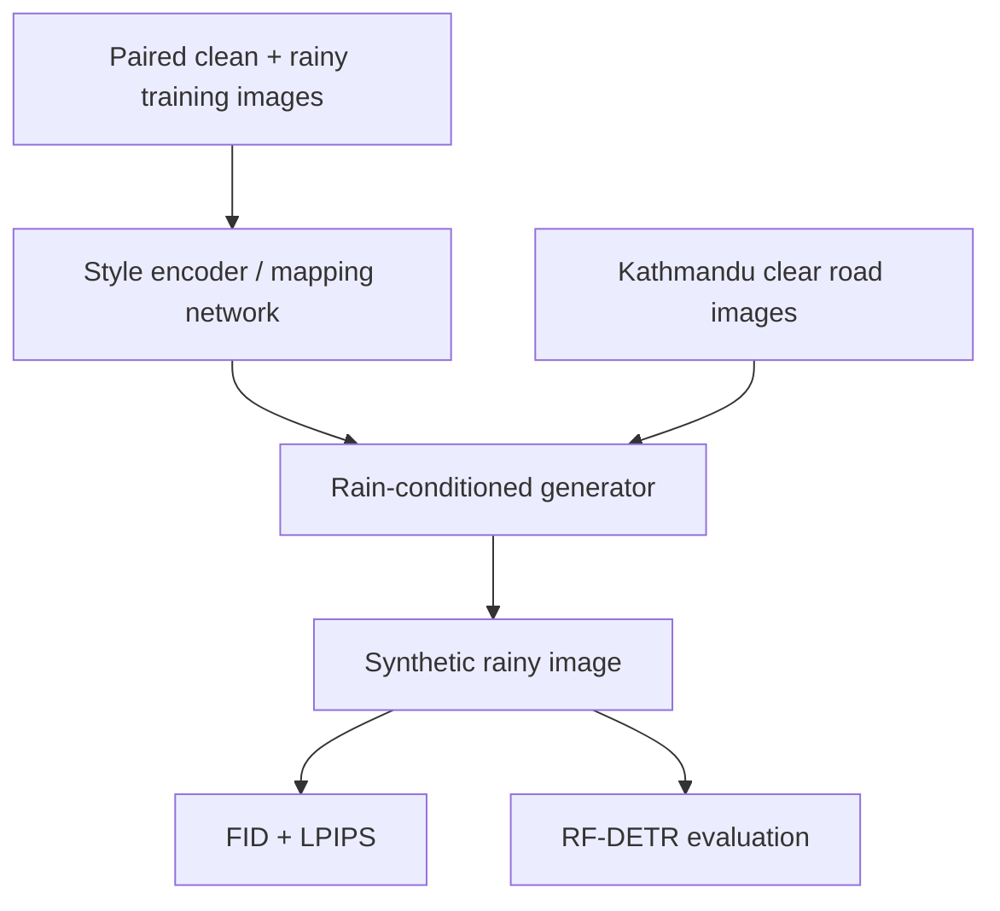

# RainGAN-Kathmandu

[](https://doi.org/10.1109/TENCON66050.2025.11374935)
[](https://doi.org/10.7910/DVN/YJRUP4)
[](https://www.python.org/)
[](https://github.com/rbhdsks/RainGAN/actions/workflows/tests.yml)

Official reproducibility code for **“RainGAN-Kathmandu: A Generative Adversarial Framework for Synthetic Rainfall Augmentation in Urban Road Scene Datasets,”** published at IEEE TENCON 2025.

RainGAN-Kathmandu learns diverse rain styles from paired clean/rain training images, transfers them to clear urban road scenes, and produces synthetic rainy images for adverse-weather vision research. This repository provides a deterministic training and generation pipeline, verified Harvard Dataverse downloads, FID/LPIPS evaluation, configuration capture, and artifact manifests.

> **Reproducibility status.** The code path and public Kathmandu data acquisition are reproducible from this repository. The original trained checkpoint and the complete paper-training corpus are not stored in Git; therefore, the paper's exact numerical results cannot be regenerated from a fresh clone until those artifacts are supplied. The README separates *reported paper results* from newly computed results for that reason.

## Method at a glance


```mermaid
flowchart TD
    A["Paired clean + rainy training images"] --> B["Style encoder / mapping network"]
    B --> C["Rain-conditioned generator"]
    C --> D["Synthetic rainy image"]
    D --> E["FID + LPIPS"]
    D --> F["RF-DETR evaluation"]
    G["Kathmandu clear road images"] --> C
```

The implementation contains a style-conditioned encoder-decoder generator, latent mapping network, style encoder, and domain discriminator. Training combines adversarial, style reconstruction, diversity, mapping alignment, normalized mutual-information, identity/bias, and R1 regularization terms. The default experiment is defined—not hidden in shell history—in [`configs/paper.yaml`](configs/paper.yaml).

## Reported results

These values are transcribed from the published paper; they are **not** claims from the current checkout.

| Generator | FID ↓ | LPIPS ↓ |
|---|---:|---:|
| DCGAN | 18.45 | 0.29 |
| Pix2Pix | 15.32 | 0.24 |
| StyleGAN | 10.57 | 0.18 |
| **RainGAN-Kathmandu** | **8.34** | **0.12** |

RF-DETR evaluated on RainGAN-augmented data achieved reported mAP values of **0.405** over IoU 0.50–0.95, **0.605** at IoU 0.50, and **0.416** at IoU 0.75. Detector training code and the exact split/checkpoint are not present in the original repository, so these numbers are documented but not presented as one-command reproduced metrics.

## Quick start

### 1. Clone and create an isolated environment

```bash
git clone https://github.com/rbhdsks/RainGAN.git
cd RainGAN

python3.11 -m venv .venv
source .venv/bin/activate              # Windows: .venv\Scripts\activate
python -m pip install --upgrade pip
python -m pip install -e .
```

For metric evaluation or development checks:

```bash
python -m pip install -e '.[evaluation,dev]'
```

For the fully locked dependency graph (recommended), use `uv sync --extra evaluation --extra dev`; [`uv.lock`](uv.lock) records all transitive versions.

Verify the resolved device, software versions, and configuration:

```bash
python main.py --config configs/paper.yaml doctor
```

### 2. Download the public Kathmandu data

The downloader calls the Harvard Dataverse API, preserves the archive layout, verifies every MD5 checksum, records the dataset version, and creates a model-ready clear-image directory.

```bash
# Paper companion release: DOI 10.7910/DVN/YJRUP4
python scripts/download_kathmandu.py --dataset primary

# Optional second Kathmandu route release
python scripts/download_kathmandu.py --dataset extension
```

To inspect live dataset versions/counts without downloading:

```bash
python scripts/download_kathmandu.py --dataset all --list-only
```

See [`docs/DATASETS.md`](docs/DATASETS.md) for DOI citations, the training-pair format, and the difference between generation images and object-detection annotations.

### 3. Prepare and validate training pairs

Training images must be horizontal clean/rain pairs with equal halves:

```text
data/rains/
├── train/
│   ├── A/
│   │   └── pair_0001.png  # [256×256 clean | 256×256 rainy]
│   └── B/
│       └── pair_0002.png
└── val/
    └── clear/
        └── image_0001.jpg
```

Validate dimensions and create a SHA-256 inventory before training:

```bash
python scripts/validate_data.py data/rains/train --paired
python scripts/validate_data.py data/rains/val
```

The original SyRaGAN setup used Rain100L, Rain100H, Rain800, Rain1200, Rain1400, and SPA-data. Their redistribution terms vary, so this repository intentionally does not scrape or silently repackage them.

### 4. Train

```bash
python main.py --config configs/paper.yaml --device cuda train
```

Useful controlled overrides:

```bash
python main.py --config configs/paper.yaml --device cuda train \
  --batch-size 4 \
  --total-iterations 100000

python main.py --config configs/paper.yaml --device cuda train \
  --checkpoint 50000 \
  --total-iterations 100000
```

Checkpoints are written atomically to `artifacts/checkpoints/raingan_kathmandu/`. Every run also writes `run_metadata.json` containing the resolved options, Git commit, Python/PyTorch versions, platform, and accelerator information.

### 5. Generate rain on Kathmandu road images

```bash
python main.py --config configs/paper.yaml --device cuda generate \
  --checkpoint 100000 \
  --input-dir data/kathmandu/clear \
  --output-dir artifacts/generated/raingan_kathmandu
```

Each input gets its own directory containing `clear.png` and five deterministic `rain_XX.png` variants. `manifest.csv` records the source, output, variant, seed, and checkpoint iteration.

### 6. Evaluate FID and LPIPS

```bash
python scripts/evaluate.py \
  --real data/evaluation/real_rain \
  --generated artifacts/generated/raingan_kathmandu \
  --output artifacts/evaluation/raingan_kathmandu/metrics.json
```

FID compares the two image distributions; the evaluator automatically excludes the pipeline's `clear.png` provenance copies from the generated set. LPIPS requires aligned real/generated pairs: either identical relative paths or a CSV supplied with `--pairs-csv` containing `real,generated` columns. If no pairs match, the JSON records LPIPS as `null` instead of inventing a pairing.

## Reproducibility controls

| Source of variation | Control in this repository |
|---|---|
| Python, NumPy, PyTorch RNGs | Single configured seed (`777`) |
| DataLoader workers/sampling | Seeded generators and worker initialization |
| Interrupted training | Python/NumPy/PyTorch and loader RNG states saved with checkpoints |
| Validation preprocessing | Deterministic resize; no random inference crop |
| cuDNN kernels | Deterministic mode; benchmark disabled |
| Configuration | Versioned YAML plus resolved run metadata |
| Dataset identity | Dataverse DOI, version, file IDs, and checksums |
| Checkpoints | Atomic writes and device-independent loading |
| Generated samples | Stable traversal and CSV provenance manifest |
| Dependencies | Exact direct versions in `pyproject.toml`; transitive lock in `uv.lock` |

The paper configuration uses `num_workers: 0` so augmentation state can be restored exactly after an interruption; increasing worker count improves throughput but weakens bitwise resume guarantees. Determinism is also hardware- and operator-dependent: minor numeric variation may remain across PyTorch/CUDA/cuDNN versions or accelerators. Keep the generated `run_metadata.json` with every result.

## Repository layout

```text
RainGAN/
├── configs/paper.yaml          # versioned paper configuration
├── core/                       # model, losses, loaders, checkpoints
├── docs/                       # data and reproduction protocols
├── scripts/                    # download, validation, evaluation
├── tests/                      # unit and smoke tests
├── main.py                     # train / sample / generate / doctor CLI
├── pyproject.toml              # pinned environment metadata
├── uv.lock                     # cross-platform transitive dependency lock
├── CITATION.cff                # machine-readable citation
└── NOTICE.md                   # upstream attribution/licensing status
```

Raw data, checkpoints, and generated artifacts are intentionally excluded from new commits. Older large binaries remain in the Git history; removing historical blobs requires a coordinated history rewrite and is not performed by this refactor.

## Tests

```bash
python -m pytest
python -m compileall -q main.py core scripts tests
```

CI runs the same checks on Python 3.11. For a fast metadata-only dataset check:

```bash
python scripts/download_kathmandu.py --dataset primary --list-only
```

## Citation

```bibtex
@inproceedings{shah2025raingan,
  title     = {RainGAN-Kathmandu: A Generative Adversarial Framework for Synthetic Rainfall Augmentation in Urban Road Scene Datasets},
  author    = {Shah, Nitesh Kumar and Jahnavi, Gadde and Singh, Navjot and Maurya, Chandra Prakash and Singh, Satish Kumar},
  booktitle = {TENCON 2025 -- 2025 IEEE Region 10 Conference},
  pages     = {1858--1862},
  year      = {2025},
  doi       = {10.1109/TENCON66050.2025.11374935}
}
```

Primary dataset citation:

> Gadde Jahnavi, Nitesh Kumar Shah, Abhishek Bidhan, Kartikeya Gullapalli, and Navjyot Singh (2025), “Dataset Kathmandu Road Ranipokhari Narayanhiti,” Harvard Dataverse, V1, [https://doi.org/10.7910/DVN/YJRUP4](https://doi.org/10.7910/DVN/YJRUP4).

GitHub also renders the machine-readable [`CITATION.cff`](CITATION.cff).

## Attribution and license status

This project builds on [SyRaGAN](https://github.com/jaewoong1/SyRa-Synthesized_Rain_dataset) and includes portions derived from [StarGAN v2](https://github.com/clovaai/stargan-v2). The inherited source header identifies Creative Commons Attribution-NonCommercial 4.0 terms. The original RainGAN repository did not contain a repository-wide license, so this refactor does not assert a new one. Review [`NOTICE.md`](NOTICE.md) before reuse, redistribution, or commercial deployment.

## Acknowledgements

The published work was conducted by researchers from IIIT Allahabad and acknowledges the supporting research environment described in the paper. Dataset credit belongs to the named Harvard Dataverse depositors; upstream implementation credit belongs to the SyRaGAN and StarGAN v2 authors.
